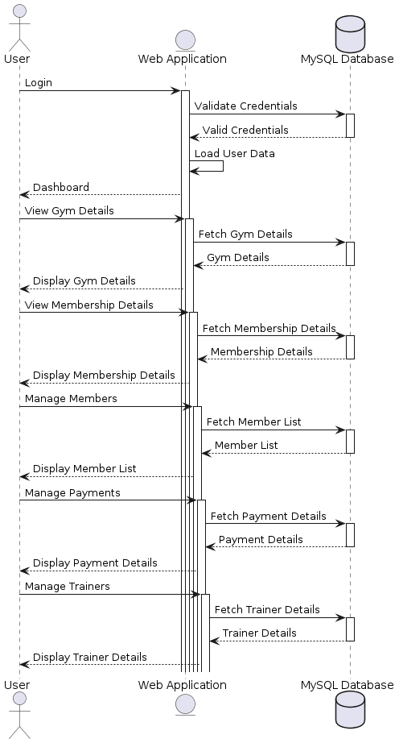
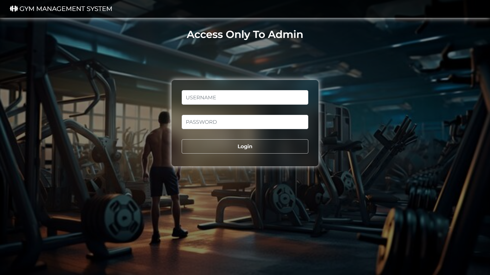
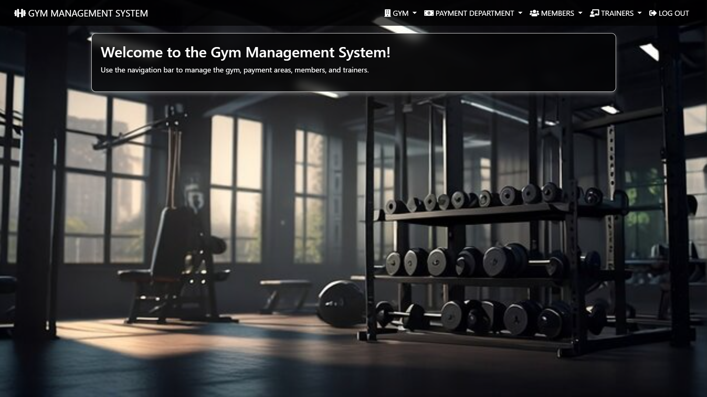

# Gym Management System 💪🏽

A web-based Gym Management System built to streamline and manage gym operations including memberships, trainers, payments, and more. This system interacts with a MySQL database to fetch and manage data, providing users with a smooth and efficient interface.

---

## 🔧 Technologies Used

- **Frontend**: HTML, CSS, JavaScript  
- **Backend**: PHP / Web Application Framework  
- **Database**: MySQL  
- **Architecture**: Client-Server model with REST-like interactions

---

## 📌 Features

- 🔐 **User Authentication** – Secure login and validation
- 🏋️‍♂️ **Gym Details** – View available gym facilities and infrastructure
- 📋 **Membership Management** – Access membership plans and details
- 👥 **Member Management** – Manage list of active and new gym members
- 💳 **Payment Details** – Monitor membership payment records
- 🧑‍🏫 **Trainer Management** – View and manage trainer information

---

## 📈 Sequence Workflow Overview

The project follows a clean MVC pattern where the frontend interacts with the backend to fetch or update data from the database. Here's the overall flow:

1. **Login** – User logs in; credentials validated via database.
2. **Dashboard** – User is redirected to dashboard with user-specific data.
3. **View Details** – Fetch and display gym, membership, members, payments, and trainers using database queries.

## 🚀 How to Run Locally

1. **Clone the repo**
   
   git clone https://github.com/your-username/gym-management-system.git.
   cd gym-management-system

2. **Set Up the Database**
   - Open **phpMyAdmin** or MySQL Workbench.
   - Create a new database named `gym_management`.
   - Import the `gym_management.sql` file from the project directory.
   - Update the database credentials in your configuration file (`db.php` or `config.php`):
     $servername = "localhost";
     $username = "root";
     $password = "";
     $dbname = "gym_management";
     

3. **Run the Project**
   - If you're using **XAMPP**:
     - Move the project folder to the `htdocs/` directory.
     - Start **Apache** and **MySQL** from the XAMPP control panel.
     - Visit `http://localhost/gym-management-system` in your browser.

---

## 📈 Sequence Diagram

The following sequence diagram explains how the system components interact with each other (User ↔ Web Application ↔ MySQL Database):

---

## 🖼️ Screenshots

- **Login Page**
- 
  
- **Dashboard**
- 
  
---
# 🙋‍♂️ Author

- **Name:** Ravi Baraker  
- **Portfolio:** [yourportfolio.com](http://ravib45-portfolio.vercel.app/)  
- **LinkedIn:** [linkedin.com/in/ravibarker](https://www.linkedin.com/in/ravibarker/)  
- **Email:** ravibarker45@gmail.com

